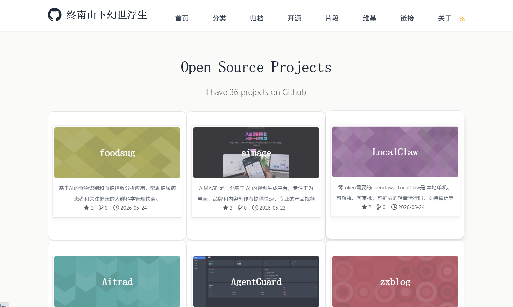

# 终南山下幻世浮生

我的个人博客：<https://anzx01.github.io >。

学习和记录。



## 许可证

本仓库中的站点源码、配置和自定义脚本按 [MIT License](LICENSE) 授权。

博客文章、个人页面内容、原创图片、二维码和其它个人素材不包含在 MIT 授权范围内；除非页面另有说明，这些内容按 [CC BY-NC-ND 4.0](https://creativecommons.org/licenses/by-nc-nd/4.0/deed.zh-hans) 授权。

`assets/vendor/`、部分 `assets/js/` 文件和外部 CDN 资源来自第三方项目，按各自许可证授权。详情见 [THIRD_PARTY_NOTICES.md](THIRD_PARTY_NOTICES.md)。

## 隐私说明

站点可能加载 GitHub Pages、giscus 评论、Busuanzi 访问统计、GitHub API、Google Analytics、Google AdSense 或 CDN 脚本。详情见 [PRIVACY.md](PRIVACY.md)。

## 使用文档

### 项目列表自动刷新

站点的「开源项目」列表来自 `jekyll-github-metadata` 的 GitHub 仓库元数据。`.github/workflows/pages.yml` 会在以下情况自动重新构建并部署博客：

- 向博客仓库 `master` 分支提交代码
- 在 GitHub Actions 页面手动运行 `Refresh project list and deploy site`
- 其它仓库发送 `repository_dispatch` 事件，类型为 `refresh-projects` 或 `refresh-site`
- 每 6 小时定时刷新一次，避免漏掉没有接入通知的新公开仓库

首次使用时，在博客仓库的 `Settings -> Pages -> Build and deployment -> Source` 里选择 `GitHub Actions`。

如果希望某个项目仓库 push 后立刻刷新博客，在那个项目仓库里新增 secret：`BLOG_REFRESH_TOKEN`。token 需要能访问 `anzx01/anzx01.github.io`，并具备 `Contents: Read and write` 权限。然后在项目仓库新增 `.github/workflows/refresh-blog.yml`：

```yaml
name: Refresh blog project list

on:
  push:
    branches:
      - main
      - master
  workflow_dispatch:

jobs:
  refresh-blog:
    runs-on: ubuntu-latest
    steps:
      - name: Trigger blog rebuild
        run: |
          curl -L -X POST \
            -H "Accept: application/vnd.github+json" \
            -H "Authorization: Bearer ${{ secrets.BLOG_REFRESH_TOKEN }}" \
            -H "X-GitHub-Api-Version: 2026-03-10" \
            https://api.github.com/repos/anzx01/anzx01.github.io/dispatches \
            -d '{"event_type":"refresh-projects","client_payload":{"source_repo":"'"${GITHUB_REPOSITORY}"'","source_sha":"'"${GITHUB_SHA}"'"}}'
```

## 经验与思考

## 联系我

可通过 GitHub 个人主页或仓库 Issue 联系我。

## 致谢

本博客外观基于 [DONGChuan](https://dongchuan.github.io) 修改，感谢！

另见 [THIRD_PARTY_NOTICES.md](THIRD_PARTY_NOTICES.md) 中保留的第三方组件和上游主题说明。
